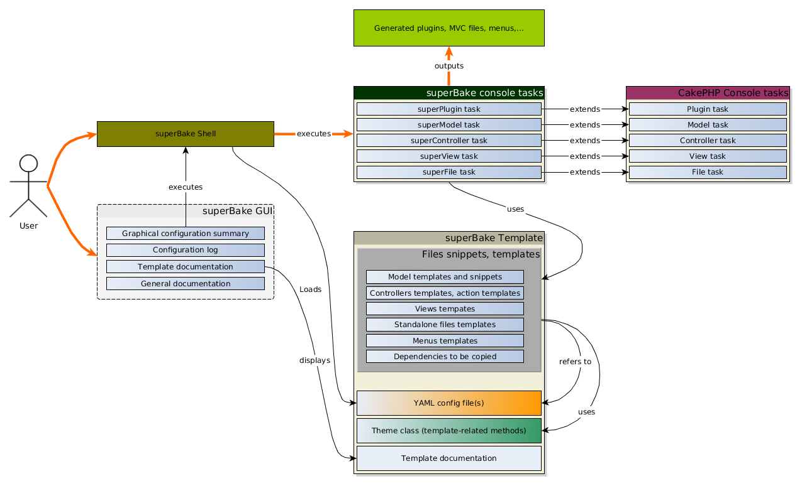

# superBake
## What is superBake
superBake is a console Shell for [__cakePHP__](http://cakephp.org/) 2.x. It will help you to generate your application's plugins, models, controllers, views and menus with a configuration file and custom templates.

Basically, it's __bake__ with modified tasks, modified template system and a configuration file.

You can find a demo video on [youtube](https://www.youtube.com/watch?v=sP9WOk7qmwA) (a bit outdated now).

## What superBake isn't

superBake is not a CMS, a blog manager or anything. It will _help_ you to create your apps. That's all.

## How it works
As you can see in the graph below, superBake extends original CakePHP baking tasks. That means the plugin should always work with the new versions of CakePHP

## Test it in a few simple steps:

 * Download CakePHP [2.4.7](https://github.com/cakephp/cakephp/zipball/2.4.7) (for example) and superBake.
 * Prepare Cake and unzip superBake in a folder named `Sb` in `app/Plugin` or in `plugins`.
 * Load the plugin in `app/bootstrap.php` with this line: `CakePlugin::load('Sb', array('bootstrap' => true));`
 * Create the database with the given samples (in `samples`). There's a SQL file and a Mysql Workbench file for the same db. Choose as you prefer.
 * Set up your db and db connection in `app/Config/database.php`
 * As the default user is 'test@example.com' and default password is 'test' (in the sql inserts), use those salts in `Config/core.php`:
   * `Configure::write('Security.salt', '3d77f505a9ce49d4d06775dc25e1599dcece8b82');`
   * `Configure::write('Security.cipherSeed', '094311676475945108371586552062');`
 * Enable the 'admin' routing prefix in `app/Config/core.php`
 * Open a browser and go to your cake Homepage. In parallel, open a terminal and cd to `PathToCakeInstall/app`
 * You may need to make the `app/Console/cake` file executable, under linux (`chmod +x Console/cake`)
 * You're ready to superBake:
  1. Plugins: `./Console/cake Sb.Shell plugins`. Choose to update the bootstrap file.
  2. Models/Controllers and views: `./Console/cake Sb.Shell mvc`
  3. Menus: `./Console/cake Sb.Shell menus`
  4. Additionnal files (custom layout and AppController): `./Console/cake Sb.Shell files`
  5. Required files (a css file): `./Console/cake Sb.Shell required`
  6. Refresh your browser.
 * Login (You will experience errors with ACOs/AROs as they are not in sync with the actions...)
 * Access admin site with prefixing your pathes with /admin/ (ie: `http://YourCakeInstall/admin/users/`
 * Access superBake GUI here: `http://YourCakeInstall/sb/sb`
 * You should experience some strange things related to the default theme, but open an issue on Github !

**Remember** that it's for testing superBake only, not to create a working app out of the box.

## What if it doesn't work as expected ?

Open an issue, explain the problem, I'll be happy to help.

## Links:

Feel free to contact me on [g+ EL-CMS](https://plus.google.com/u/0/b/110073171539347252283/) or by [mail](mailto:m.tancoigne@gmail.com) (with "superBake" in the beginning of your subject), i'll try to answer quickly.

For now, the configuration file provided with the plugin is the one I work on, so it's not an empty config file. You can test it with the models structure available in `docs/`.

Trello [board](https://trello.com/b/n2thkRPQ/superbake) to discuss about the project
